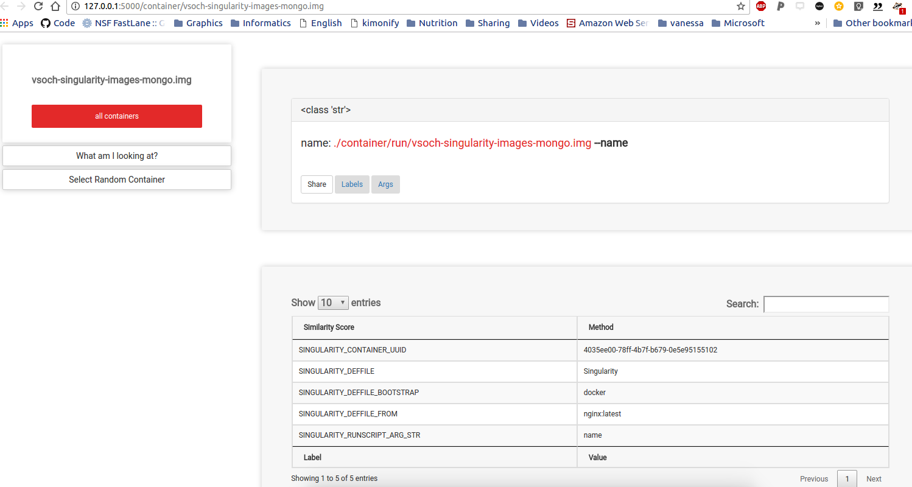

# Singularity Containers Nginx

## Introduction
This small web application runs Singularity containers from a URL. The containers are expected to print some response to the console, and this response is rendered as a web view when the container address is gone to. Read these instructions carefully, so you know how to define acceptable arguments for the container to transmit to the user.




## Designing Containers

### Input Arguments
Your containers will simply be run, and named input arguments provided as POST. These arguments are parsed from the container's labels, which you define in the boostrap specification (build) file. For example, here is how to define each of a list of floats, ints, strings, and booleans:

```bash
Bootstrap: docker
From: ubuntu:14.04

%labels

SINGULARITY_RUNSCRIPT_ARG_STR name,ice-cream
SINGULARITY_RUNSCRIPT_ARG_INT age
SINGULARITY_RUNSCRIPT_ARG_FLOAT height,weight
SINGULARITY_RUNSCRIPT_ARG_BOOL is_male,isHungry
```

Note that the capitalization of the label names (the first in each pair) does not matter - all labels are converted to uppercase. The label names themselves, however, will not be parsed. For each of the above, we would expect the container to be run with something like:


      ./container.img --name Amy --age 10 --isHungry


And the labels are stored with the container in `/.singularity/labels.json` as:


```bash
{
    "SINGULARITY_DEFFILE_BOOTSTRAP": "docker",
    "SINGULARITY_DEFFILE": "Singularity",
    "SINGULARITY_DEFFILE_FROM": "ubuntu:14.04",
    "SINGULARITY_CONTAINER_UUID": "4035ee00-78ff-4b7f-b679-0e5e95155102",
    "SINGULARITY_RUNSCRIPT_ARG_STR": "name,ice-cream",
    "SINGULARITY_RUNSCRIPT_ARG_INT": "age",
    "SINGULARITY_RUNSCRIPT_ARG_FLOAT": "height,weight",
    "SINGULARITY_RUNSCRIPT_ARG_BOOL": "is_male,isHungry"
}
```

And when the container is run via this application, the user (or application making the post) can retrieve the labels, and then would allow for a url that looks like this: `http://localhost/container/run/container.img?name=Amy&age=10&isHungry=1`


### Executable Runscript
This means that you should have a runscript (equivalent to an entrypoint in a Dockerfile, that does the following:

 - accepts the input arguments that you defined above, with the correct format (float,int,str,boolean)
 - for each argument, it should be named, and be like `--name`
 - the output to the screen should be a json or text response. It will be parsed first as json, and if this fails, returned as text (appropriate for csv, tsv, or other).

If your container runs without any input arguments, this is fine too. You should assume that any label that you define will be presented to the user as an option, and any label that you don't provide will not be.

With this simple setup, the container is run by the web server, and the response is returned to the user, ideally as json. An important note is that you should design the container to not have extra print or debug statements, and not include any arugments like `--debug` that might add them when you define labels. 


## Deployment
You should clone the repo, and build the container (or you can also just clone and then use docker-compose and it will be pulled from Docker Hub).


```bash
git clone https://www.github.com/vsoch/singularity-nginx
cd singularity-nginx
docker build -t vanessa/singularity-nginx .
```

### Adding Containers
While we could add an endpoint to the Singularity Hub API to run any container, the intended use case of this first version is more controlled, meaning that you should pull the containers you want to provide to the [data](data) folder. You can do this from inside or outside of the container, as long as the file gets there. The folder is mapped to the host, so anything on the host will be available in the container. For example.
          
```bash
cd data
singularity pull shub://vsoch/singularity-images
```

## Deployment
You can use docker compose to deploy:

```bash          
docker-compose up -d
```
and then go to `127.0.0.1` (localhost). The containers available will be shown on the screen. 

## Endpoints
Here are some useful endpoints:

### Views
 - `/`: the root will show all containers available. When the user selects, he/she is taken to a screen to see input arguments. 
 - `/containers/random`: will return a random container
 - `/container/container.img`: will show metadata about a container.

### API
The following are considered API, meaning they return a text or json response, not intended for the user to interact with.

 - `/api/containers`: a list of all available containers
 - `/api/container/<string:name>`: a json object with container args, labels, and links.
 - `/api/container/args/<string:name>`: json of just container args
 - `/api/container/labels/<string:name>`: json of juist container labels
 - `/container/run/container.img`: Is the base for running a container, this one would be container.img. Arguments can be added as POST (eg, `?name=Amy`)
